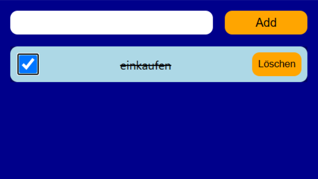

# To-Do-App


Web-Applikation zur digitalen Organisation und Verwaltung täglicher Aufgaben. Die App wurde als Single-Page-Application mit React umgesetzt und ermöglicht es Benutzern, neue Aufgaben über ein interaktives Eingabefeld anzulegen, diese über Checkboxen als erledigt zu markieren und vollständig aus der Liste zu entfernen.

## Voraussetzungen
Für die lokale Ausführung und das Kompilieren des Projekts werden folgende Komponenten benötigt:
* Node.js (aktuelle LTS-Version)
* Ein moderner Webbrowser
* Git (optional, falls Sie das Repository klonen möchten)

## Technologien
* **HTML5:** Basis-Strukturierung der Einstiegsseite für das dynamische React-Root-Rendering im DOM-Knoten (`#root`).
* **CSS3:** Modulares Styling zur visuellen Kennzeichnung erledigter Aufgaben, zur Gewährleistung der Barrierefreiheit sowie zur Umsetzung eines vertikal scrollbaren Layouts.
* **React:** Komponentenbasiertes UI-Rendering zur Aufteilung der Benutzeroberfläche in wiederverwendbare Bausteine unter Verwendung des strikten Entwicklungsmodus (`<React.StrictMode>`).
* **JavaScript (ES6+):** Logiksteuerung, zustandsbasierte Array-Manipulationen (`.map()`, `.filter()`) und zentrales Zustandsmanagement via Hooks.

## Technische Funktionsweise
Die Anwendung basiert auf einer komponentenorientierten Client-Side-Architektur und wird über einen zentralisierten Datenfluss gesteuert:

### Zentrales Zustandsmanagement (`App.js`)
Die Hauptkomponente verwaltet den globalen Anwendungszustand für die gesamte Aufgabenliste (`todos`) zentral über den React-Hook `useState`. Die Zustandshistorie und die zuständigen Manipulationsfunktionen werden über Props abwärts an die Kindkomponenten delegiert. 
* **Hinzufügen:** Verwendet den Spread-Operator (`[...todos, todo]`), um neue Aufgabenobjekte anzulegen, gekoppelt mit einer sicheren Identifikationsnummer via `crypto.randomUUID()`.
* **Invertieren:** Nutzt eine `.map()`-Schleife, um beim Umschalten einer Checkbox gezielt eine Kopie des betroffenen To-Dos mit modifiziertem `done`-Status zu erzeugen.
* **Entfernen:** Filtert gelöschte Einträge mit der Methode `.filter()` präzise aus dem Array heraus.

### Kontrollierte Eingabe und Validierung (`InputAndButton.js`)
Das Eingabefeld wird als kontrollierte React-Komponente geführt. Ein lokaler Zustand (`inputValue`) spiegelt über den `onChange`-Handler zu jeder Zeit den Inhalt des Textfeldes wider. Der Hinzufügen-Button besitzt eine native Validierungsprüfung (`disabled={inputValue.trim().length < 1}`). Er wird automatisch deaktiviert, wenn das Eingabefeld leer ist oder nur aus Leerzeichen besteht, um die Erstellung leerer Aufgaben auf Systemebene zu blockieren.

### Dynamische Listengenerierung und Barrierefreiheit (`ToDoList.js` & `ToDoElement.js`)
* **Bedingtes Rendering:** Die Komponente `ToDoList` prüft die Länge des übergebenen Arrays. Wenn keine Aufgaben vorhanden sind, wird ein definierter Fallback-Text („keine ToDos“) ausgegeben. Bei vorhandenen Daten wird das Array über `.map()` iteriert und für jeden Eintrag eine `ToDoElement`-Komponente erzeugt, die über das `key`-Attribut stabil im Virtual DOM referenziert wird.
* **Barrierefreiheit (Accessibility):** Innerhalb des `ToDoElement` ist das beschreibende Label über das `htmlFor`-Attribut strukturell fest mit der eindeutigen `id` der Checkbox verknüpft. Dadurch können Benutzer auch direkt auf den Aufgabentext klicken, um den Status umzuschalten. Erledigte Aufgaben erhalten den Klassenzusatz `.is-done`, welcher den Text visuell durchstreicht.

## Layout und Design
Die visuelle Gestaltung ist auf ein zentriertes Benutzererlebnis ausgelegt:
* **Fullscreen-Rahmen:** Der Body-Bereich fixiert die Anwendung auf die exakten Maße des Browserfensters (`100vh`/`100vw`) und verwendet einen dunkelblauen Hintergrund (`darkblue`).
* **Listenbegrenzung:** Die To-Do-Liste besitzt eine maximale Höhe von `800px`. Über die Eigenschaft `overflow-y: auto` wird sichergestellt, dass die Anwendung bei einer hohen Anzahl an Aufgaben innerhalb des definierten Bereichs vertikal scrollbar bleibt. Die Scrollbalken-Anzeige wird für ein minimalistisches Erscheinungsbild ausgeblendet.

## Installation
Klonen Sie das Projekt auf Ihren lokalen Computer und installieren Sie die erforderlichen Abhängigkeiten über den Paketmanager:

```bash
# Repository klonen
git clone https://github.com

# In den Projektordner navigieren
cd todo-app

# Abhängigkeiten installieren
npm install
```

## Nutzung
1. Starten Sie den lokalen Entwicklungsserver mit folgendem Befehl:
   ```bash
   npm start
   ```
2. Öffnen Sie die in der Konsole angezeigte lokale URL (Standard: `http://localhost:3000`) in Ihrem Webbrowser.
3. Nutzen Sie das interaktive Eingabefeld, um neue tägliche Aufgaben zu erfassen und der Liste hinzuzufügen.
4. Markieren Sie erledigte Einträge flexibel über die integrierten Checkboxen oder den Aufgabentext, um den Status visuell anzupassen.
5. Entfernen Sie bei Bedarf eine Aufgabe über die Schaltfläche „Löschen“ aus der Übersicht.

## Deployment
Die Anwendung kann für die Veröffentlichung gebaut und statisch gehostet werden:
1. Erzeugen Sie die produktionsbereiten Dateien im `build`-Ordner:
   ```bash
   npm run build
   ```
2. Der Inhalt dieses Ordners kann anschließend direkt über Plattformen wie GitHub Pages, Vercel oder Netlify live geschaltet werden.

## Lizenz
Dieses Projekt wurde von Xenia Wilczek erstellt. Alle Rechte an Code und Design vorbehalten (All Rights Reserved).
